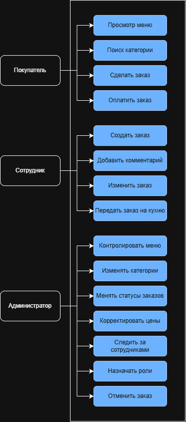
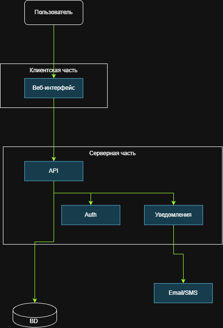

# Вариант 13. Система учета заказов ресторана

## Описание системы

Система предназначена для обработки заказов посетителей ресторана. Необходимо учитывать блюда, категории меню, заказы и клиентов. Сотрудники ресторана должны иметь возможность создавать и изменять заказы, а администратор — управлять меню и контролировать заказы.

## Проблема

В традиционном (бумажном или разрозненном) учете официанты тратят время на передачу заказов на кухню, администратор не видит актуальную картину занятости залов и статусов готовности блюд в реальном времени, а клиенты сталкиваются с задержками и ошибками в счете. Это приводит к потере прибыли из-за «забытых» позиций, ухудшению качества сервиса и сложности анализа продаж.

## Цель

Создание информационной системы для централизованного создания, изменения и контроля заказов в ресторане без потери данных.

## Область применения

Система предназначена для использования официантами, администраторами и поварами ресторана для создания, обработки и отслеживания заказов посетителей.

## Роли

| Роль | Назначение | Основные действия |
|:---|:---|:---|
| **Клиент** | Получение информации о меню | Просматривать актуальное меню, оплачивать заказ |
| **Сотрудник** | Обслуживание посетителей, взаимодействие с кухней | Создавать новый заказ для клиента, изменять заказ клиента, вносить особые пожелания клиента в заказ, передавать заказ на кухню |
| **Администратор** | Контроль меню, всех заказов, управление сотрудниками, полное управление системой | Управлять меню, контролировать и изменять статус заказа, корректировать цены блюд, их состав, просматривать историю изменений, администрировать все заказы, отменять заказы, управлять сотрудниками, управлять версиями меню |

## Функциональные требования

1. Система должна обеспечивать возможность просмотра актуального меню с разбивкой по категориям, с указанием названия блюда, описания, цены, веса, калорийности и времени приготовления.

2. Система должна позволять создавать новый заказ с указанием клиента (существующего или нового), списка выбранных блюд с количеством, особыми пожеланиями по каждому блюду и комментарием к заказу.

3. Система должна предоставлять возможность управления составом заказа.

4. Система должна обеспечивать изменение статуса заказа с фиксацией времени перехода между статусами.

5. Система должна позволять просматривать историю всех заказов.

6. Система должна обеспечивать автоматический расчет итоговой суммы заказа.

7. Система должна реализовывать CRUD для администратора (управление меню, например).

8. Система должна предоставлять возможность создания нескольких версий меню.

9. Система должна обеспечивать аутентификацию и авторизацию пользователей с использованием логина и пароля.

10. Система должна предоставлять возможность поиска и фильтрации заказов по различным критериям.

11. Система должна позволять администратору управлять учетными записями сотрудников.

## Предназначение информационной системы

- Автоматизация процесса приема, обработки и выполнения заказов посетителей ресторана.
- Управление меню (блюда, категории, версии меню).
- Ведение учета клиентов и истории их заказов.
- Контроль работы сотрудников и эффективности обслуживания.

## Основные возможности

- Оперативный прием заказов
- Управление составом заказа
- Контроль готовности заказов
- Актуальное меню для всех
- Гибкое управление меню
- Аналитика и отчеты

## Тип системы

Веб-приложение

## Основные компоненты

- Пользователи
- Web-интерфейс
- Серверная часть
- База данных

## Результат работы системы

В результате работы системы пользователь получает возможность централизованно обрабатывать заказы с минимальным влиянием человеческого фактора на их содержание.

# Лабораторная работа 2

## 1. Пользователи и роли

| Роль | Назначение | Основные действия | Уровень доступа |
| --- | --- | --- | --- |
| Клиент | Получение информации о меню | Просматривать актуальное меню, оплачивать заказ | Ограниченный |
| Сотрудник | Обслуживание посетителей, взаимодействие с кухней | Создавать новый заказ для клиента, изменять заказ клиента, вносить особые пожелания клиента в заказ, передавать заказ на кухню | Расширенный |
| Администратор | Контроль меню, всех заказов, управление сотрудниками, полное управление системой | Управлять меню, контролировать и изменять статус заказа, корректировать цены блюд, их состав, просматривать историю изменений, администрировать все заказы, отменять заказы, управлять сотрудниками, управлять версиями меню | Полный |

## 2. Сценарии использования

### Сценарий 1. Просмотр актуального меню

| Параметр | Описание |
| --- | --- |
| Название | Просмотр актуального меню |
| Инициатор | Клиент |
| Пошаговое описание | 1. Клиент открывает систему. 2. Переходит в раздел «Меню». 3. Система отображает категории блюд. 4. Клиент выбирает категорию. 5. Система отображает список блюд с названием, описанием, ценой, весом, калорийностью и временем приготовления. |
| Ожидаемый результат | Клиент получает полную информацию о блюдах актуального меню |

### Сценарий 2. Создание нового заказа

| Параметр | Описание |
| --- | --- |
| Название | Создание нового заказа |
| Инициатор | Сотрудник |
| Пошаговое описание | 1. Сотрудник авторизуется в системе. 2. Выбирает клиента (существующего или создает нового). 3. Добавляет блюда из меню с указанием количества. 4. Вносит особые пожелания по каждому блюду. 5. Добавляет комментарий к заказу. 6. Система автоматически рассчитывает итоговую сумму. 7. Сотрудник подтверждает создание заказа. |
| Ожидаемый результат | Заказ создан, передан на кухню, клиент уведомлен |

### Сценарий 3. Изменение состава заказа

| Параметр | Описание |
| --- | --- |
| Название | Изменение состава заказа |
| Инициатор | Сотрудник |
| Пошаговое описание | 1. Сотрудник находит активный заказ. 2. Открывает его для редактирования. 3. Добавляет или удаляет блюда. 4. Меняет количество порций. 5. Корректирует особые пожелания. 6. Система пересчитывает итоговую сумму. 7. Сотрудник сохраняет изменения. |
| Ожидаемый результат | Заказ обновлен, новая сумма рассчитана, кухня уведомлена |

### Сценарий 4. Изменение статуса заказа

| Параметр | Описание |
| --- | --- |
| Название | Изменение статуса заказа |
| Инициатор | Сотрудник |
| Пошаговое описание | 1. Сотрудник открывает список активных заказов. 2. Выбирает заказ. 3. Изменяет статус (НОВЫЙ → ПРИНЯТ → ГОТОВИТСЯ → ГОТОВ → ВЫДАН → ОПЛАЧЕН). 4. Система фиксирует время перехода между статусами. 5. Система уведомляет ответственных лиц. |
| Ожидаемый результат | Статус заказа обновлен, время перехода зафиксировано |

### Сценарий 5. Управление меню (CRUD)

| Параметр | Описание |
| --- | --- |
| Название | Управление меню |
| Инициатор | Администратор |
| Пошаговое описание | 1. Администратор авторизуется в системе. 2. Переходит в раздел «Управление меню». 3. Создает, редактирует или удаляет блюда. 4. Корректирует цены, состав, категории. 5. Создает новые версии меню. 6. Сохраняет изменения. |
| Ожидаемый результат | Меню обновлено, изменения доступны всем пользователям |

### Сценарий 6. Управление учетными записями сотрудников

| Параметр | Описание |
| --- | --- |
| Название | Управление учетными записями сотрудников |
| Инициатор | Администратор |
| Пошаговое описание | 1. Администратор переходит в раздел «Сотрудники». 2. Просматривает список учетных записей. 3. Создает новую учетную запись или редактирует существующую. 4. Назначает роль и права доступа. 5. Блокирует или удаляет учетную запись при необходимости. |
| Ожидаемый результат | Учетные записи сотрудников обновлены, права доступа настроены |

---

## 3. Компоненты системы

| Компонент | Назначение |
| --- | --- |
| Веб-интерфейс (Frontend) | Предоставление пользовательского интерфейса для всех ролей системы |
| Серверная часть (Backend) | Обработка бизнес-логики, обработка запросов, расчет сумм заказов |
| База данных | Хранение всех данных системы (пользователи, меню, заказы, клиенты) |
| Система аутентификации | Проверка подлинности пользователей, разграничение прав доступа |
| Система уведомлений | Уведомление сотрудников о новых заказах и изменении статусов |

### Взаимодействие компонентов

| От компонента | К компоненту | Тип взаимодействия |
| --- | --- | --- |
| Веб-интерфейс | Серверная часть | HTTP-запросы (REST API) |
| Серверная часть | База данных | SQL-запросы |
| Серверная часть | Система аутентификации | Вызовы методов аутентификации |
| Система аутентификации | База данных | SQL-запросы (проверка учетных данных) |
| Серверная часть | Система уведомлений | Отправка уведомлений |

### Описание диаграммы

На диаграмме компонентов показаны:

| Тип | Элементы |
| --- | --- |
| Пользователи (внешние актёры) | Клиент, Сотрудник, Администратор |
| Основные компоненты системы | Веб-интерфейс (Frontend), Серверная часть (Backend / API), База данных, Система аутентификации, Система уведомлений |

### Связи между компонентами

- Пользователи взаимодействуют с **Веб-интерфейсом** через браузер.
- **Веб-интерфейс** отправляет HTTP-запросы к **Серверной части**.
- **Серверная часть** выполняет SQL-запросы к **Базе данных**.
- **Серверная часть** взаимодействует с **Системой аутентификации** для проверки прав доступа.
- **Серверная часть** отправляет уведомления через **Систему уведомлений**.

## 4. Концепция информационной системы

### Назначение и цель системы

Автоматизация процесса приема, обработки и выполнения заказов посетителей ресторана. Управление меню (блюда, категории, версии меню). Ведение учета клиентов и истории их заказов. Контроль работы сотрудников и эффективности обслуживания.

### Основные возможности

- Оперативный прием заказов
- Управление составом заказа
- Контроль готовности заказов
- Актуальное меню для всех
- Гибкое управление меню
- Аналитика и отчеты

### Тип системы

Веб-приложение

### Основные компоненты и их взаимодействие

| Компонент | Взаимодействие |
| --- | --- |
| Пользователи | Взаимодействуют с веб-интерфейсом через браузер |
| Web-интерфейс | Отправляет HTTP-запросы к серверной части |
| Серверная часть | Обрабатывает бизнес-логику, выполняет SQL-запросы к базе данных, взаимодействует с системой аутентификации и уведомлений |
| База данных | Хранит данные, отвечает на SQL-запросы серверной части |
| Система аутентификации | Проверяет учетные данные пользователей |
| Система уведомлений | Отправляет уведомления о событиях |

### Результат работы системы

В результате работы системы пользователь получает возможность централизованно обрабатывать заказы с минимальным влиянием человеческого фактора на их содержание.

---